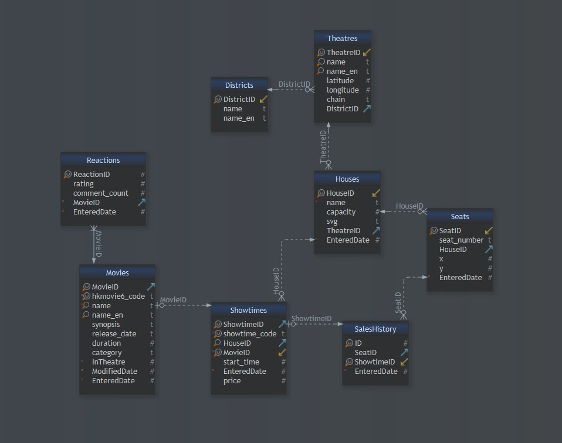
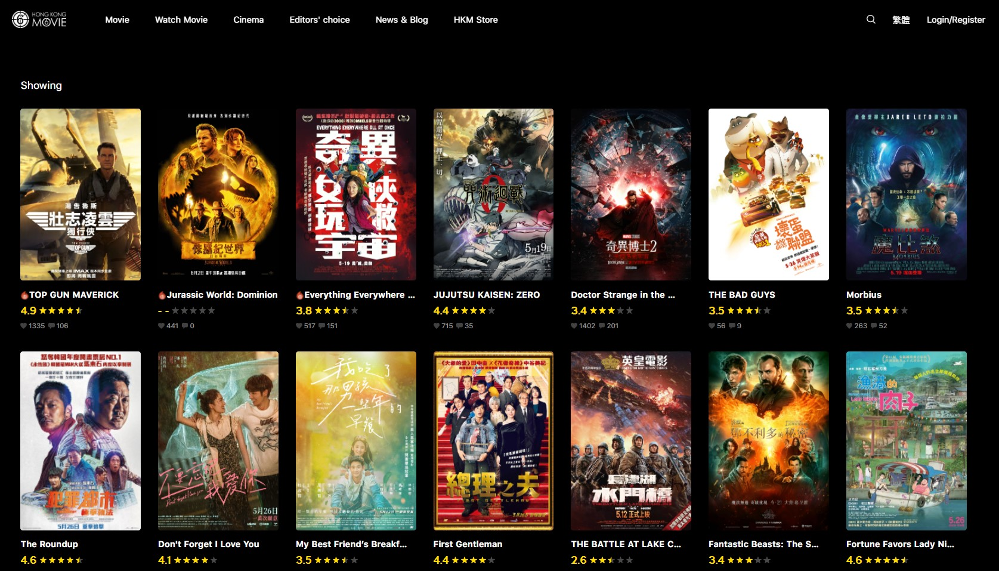
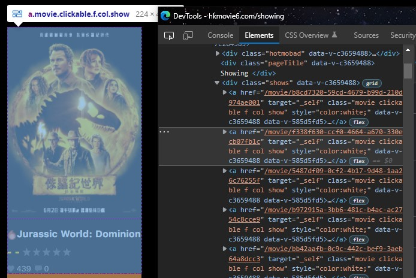
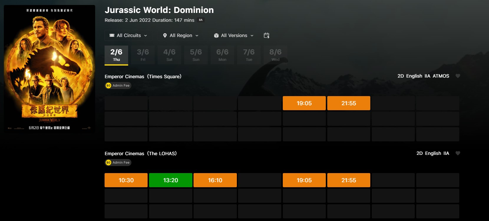
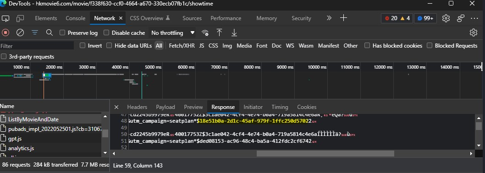
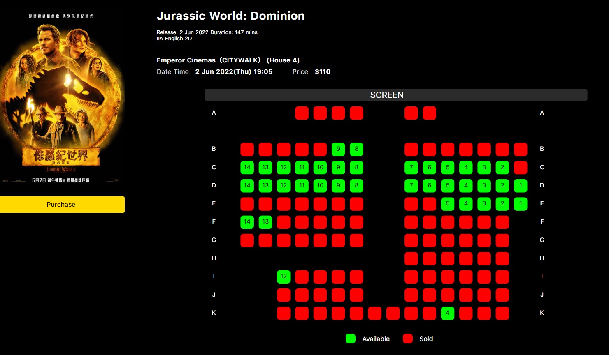

<div id="top"></div>
<!--
*** Thanks for checking out the Best-README-Template. If you have a suggestion
*** that would make this better, please fork the repo and create a pull request
*** or simply open an issue with the tag "enhancement".
*** Don't forget to give the project a star!
*** Thanks again! Now go create something AMAZING! :D
-->


<!-- PROJECT SHIELDS -->
<!--
*** I'm using markdown "reference style" links for readability.
*** Reference links are enclosed in brackets [ ] instead of parentheses ( ).
*** See the bottom of this document for the declaration of the reference variables
*** for contributors-url, forks-url, etc. This is an optional, concise syntax you may use.
*** https://www.markdownguide.org/basic-syntax/#reference-style-links
-->
[![Contributors][contributors-shield]][contributors-url]
[![Forks][forks-shield]][forks-url]
[![Stargazers][stars-shield]][stars-url]
[![Issues][issues-shield]][issues-url]
[![MIT License][license-shield]][license-url]
[![LinkedIn][linkedin-shield]][linkedin-url]


<!-- PROJECT LOGO -->
<br />
<div align="center">

<h3 align="center">Hong Kong - Cinemas Scrapers</h3>

  <p align="center">
	Extract, Transform, and Load the most up-to-date cinemas and showtimes data from the internet to a relational database.
    <br />
    <a href="https://github.com/tophersss/HongKong-CinemasData"><strong>Explore the docs »</strong></a>
    <br />
    <br />
    <a href="https://github.com/github_username/repo_name/issues">Report Bug</a>
    ·
    <a href="https://github.com/github_username/repo_name/issues">Request Feature</a>
  </p>
</div>


<!-- TABLE OF CONTENTS -->
<details>
  <summary>Table of Contents</summary>
  <ol>
    <li>
      <a href="#about-the-repository">About The Repository</a>
    </li>
    <li>
        <a href="#technologies-used">Technologies Used</a>
    </li>
    <li>
        <a href="#data-collected">Data Collected</a>
    </li>
    <li>
      <a href="#getting-started">Getting Started</a>
      <ul>
        <li><a href="#prerequisites">Prerequisites</a></li>
        <li><a href="#installation">Installation</a></li>
      </ul>
    </li>
    <li>
        <a href="#approach">Approach</a>
        <ul>
            <li><a href="#approach-scraper-1">Scraper 1: hkmovies-spider</a></li>
            <li><a href="#approach-scraper-2">Scraper 2: ShowtimeScraper</a></li>
            <li><a href="#approach-scraper-3">Scraper 3: SeatplanScraper</a></li>
        </ul>
    </li>
    <li><a href="#license">License</a></li>
    <li><a href="#contact">Contact</a></li>
    <li><a href="#acknowledgments">Acknowledgments</a></li>
  </ol>
</details>


<!-- ABOUT THE REPOSITORY -->
## 🧐 About The Repository
<div id="about-the-repository"></div>

This repository contains 3 scrapers to collect movie info, show time schedules, and real-time seat plan previews respectively from [hkmovie6][hkmovie6-url], a locally renowned platform to browse such information. 

Due to the complexity of the mentioned website, each scraper was built using a different scraping framework. You may find the explanations in the Approach section.   

<strong>The scrapers had successfully collected data of 104,000 shows and 425 movies since October 2021.</strong>

A SQLite database was set up to store the collected data, it can be found here: `data/hkmovies-db`. Alternatively, follow the  


<p align="right">(<a href="#top">back to top</a>)</p>


<div id="data-collected"></div>

## 📚  Data Collected

Data collected from over 100,000 shows and 425 movies are stored in a SQLite database `data/hk-movies.db`.



<details>
<summary>Database Structure</summary>

`Movies` table stores the movies that were shown on cinema screen in Hong Kong since the start of this project, and has a one-to-many relationship with `Showtimes` table.

Sample:

|MovieID | hkmovie6_code | name | name_en | synopsis | release_date | duration | category | InTheatre | ModifiedDate | EnteredDate | 
| :---: |  :---: | :---: | :---: | :---: | :---: | :---: | :---: | :---: | :---: | :---: | 
|367 | b8cd7320-59cd-4679-b99d-210d974ae001 | 壯志凌雲：獨行俠 | TOP GUN MAVERICK | … | 44706 | 130 | IIA | 1 | 1654135233 | 1652177462 | 
|368 | b972915a-3bb6-481c-b4ac-ac2754c8cce9 | 劇場版 咒術迴戰 0 | JUJUTSU KAISEN: ZERO | … | 44699 | 105 | IIA | 1 | 1654135233 | 1652234438 | 
|369 | 337e3399-cffb-468b-a9b3-f06b6c27991f | 壞蛋聯盟 | THE BAD GUYS | … | 44706 | 100 | I | 1 | 1654135233 | 1652263236 | 

`Showtimes` table stores the information of movie showtimes, and has a one-to-many relationship with `SalesHistory` table. 

Each record in `SalesHistory` represents each seat taken in a movie show.

[SQLiteStudio] (https://sqlitestudio.pl/) was used to manage and query the database.

</details>


<!-- TECHNOLOGIES USED -->
<div id="technologies-used"></div>

## 👨‍💻  Technologies Used

* [Python 3.9](https://www.python.org/downloads/release/python-391/)
* [Scrapy](https://pypi.org/project/Scrapy/2.5.0/)
* [selenium](https://pypi.org/project/selenium/4.1.3/)
* [selenium-wire](https://pypi.org/project/selenium-wire/4.6.3/)
* [requests-html](https://pypi.org/project/requests-html/0.10.0/)
* [lxml](https://pypi.org/project/lxml/4.6.3/)
* [SQLite](https://www.sqlite.org/index.html)


<p align="right">(<a href="#top">back to top</a>)</p>


<!-- GETTING STARTED -->
<div id="getting-started"></div>

## 🚀 Getting Started

To get a local copy up and running follow these simple example steps.


<div id="prerequisites"></div>

### Prerequisites

* [geckodriver](https://github.com/mozilla/geckodriver/releases) - download the version that matches your Firefox browser, place it in `plug-ins` folder


<div id="installation"></div>

### Installation

1. Clone the repo
   ```sh
   git clone https://github.com/tophersss/HongKong-CinemasScrapers.git
   ```
2. Install required packages
   ```sh
   pip install requirements.txt
   ```
    
3. Run `ScheduledTasks/scrape_hkmovie6.py` to scrape showing movies

4. Run `ScheduledTasks/scrape_showtime.py` to scrape show schedules

5. Run `ScheduledTasks/scrape_seatplan.py` to scrape show details and seatplan data


<p align="right">(<a href="#top">back to top</a>)</p>


<!-- APPROACH -->
<div id="approach"></div>

## 👣 Approach

This section provides detailed explanations on how each scraper collected data from various views on [hkmovie6][hkmovie6-url].
 

<div id="approach-scraper-1"></div>

### <u>Scraper 1: hkmovies-spider</u>
<details>
As the starting point of the whole scraping process, this scraper was used to collect details of the movies that are or will be showing in cinemas, including:

* **hkmovie6_code**: a unique 36-characters string that constitutes the url address to a "Movie Profile" screen
* **movie titles**
* **synopsis**
* **release date**
* **duration**
* **category**: film classification
* **rating**: a score generated through the votes of hkmovie6's user community 
* **like**: number of thumb ups from the users
* **comment count**: number of comments from the users 

There were a handful of fields to collect, and not all were visible on the ["Showing Movies" screen](https://hkmovie6.com/showing).


To view information such as release date, one had to navigate to the ["Movie Profile" screen](https://hkmovie6.com/movie/f338f630-ccf0-4664-a670-330ecb07fb1c).


I chose to build this scraper with Scrapy because it provides an asynchronous mechanism to make requests in parallel which was perfect for my need to follow the movies from the "Showing Movies" screen to their own "Profile" screens.

The plan was to let the scraper start in ["Showing Movies" screen](https://hkmovie6.com/showing), scrape the hyperlinks to all showing movies, 
and loop through each ["Movie Profile" screen](https://hkmovie6.com/movie/f338f630-ccf0-4664-a670-330ecb07fb1c) to scrape the necessary details.  



Unfortunately, the href attribute of this &lt;a&gt; tag was generated by JavaScript which Scrapy is unable to handle. As a workaround, 
[requests-html](https://pypi.org/project/requests-html/0.10.0/) was used to render the JavaScript and load the href attributes 
on the ["Showing Movies" screen](https://hkmovie6.com/showing), before passing them as a list to the Scrapy crawler.

```python
from requests_html import HTMLSession

_session = HTMLSession()
_r = _session.get('https://hkmovie6.com/showing')
_r.html.render(timeout=30)
```

The crawler then used the css selectors and regular expressions defined in the `MoviespiderSpider` class in `hkmovie/hkmovie/spiders/MovieSpider.py` to scrape the above-mentioned fields.

At 10:00am, 06:00pm, 02:00am every day, Windows Task Scheduler ran `ScheduledTasks/scrape_hkmovie6_code.bat` 
to start this scraper. 

<p align="right">(<a href="#top">back to top</a>)</p>

</details>


<div id="approach-scraper-2"></div>

### <u>Scraper 2: ShowtimeScraper</u>
<details>
After the showing movies are identified, the next step is to find the showtimes.

Imho, this part proved to be the most challenging as none of the conventional/popular scraping frameworks worked.

Movie showing schedule could be found in this url: [https://hkmovie6.com/movie/{hkmovie6_code}/showtime](https://hkmovie6.com/movie/f338f630-ccf0-4664-a670-330ecb07fb1c/showtime)


To browse the available shows of a specific date, hit the button for that date.

To bring up the real-time seatplan, 
hit the "showing time button" and the seatplan would open in this url:
[https://hkmovie6.com/movie/{hkmovie6_code}/showtime/{showtime_code}](https://hkmovie6.com/movie/f338f630-ccf0-4664-a670-330ecb07fb1c/showtime/986fc01e-85d7-4c82-8ab8-c1cd4a966450)


All I needed to do was to figure out a way to collect `showtime_code`.

And immediately two problems emerged:
1. show schedules of different dates were generated on date button click - I couldn't use Scrapy to scrape the dynamic content without proper pagination
2. urls to seatplans were not embedded in the HTML, not even after JavaScript was rendered

I spent a considerable amount of time to read the raw HTML, track the click event with DevTools, make HTML request with custom headers; none worked.

Using selenium to simulate the button clicks was the last thing I want to do because of how inefficient, time and resource consuming it was. 

At some point, I discovered an HTML request called `ListByMovieAndDate` with all the `showtime_code` concealed in its response.


However, the website's backend was using [gRPC-Web client](https://github.com/grpc/grpc-web) 
and did not accept normal HTML requests, thus the [requests](https://pypi.org/project/requests/) library was not a viable option.

Eventually, I found [selenium-wire](https://pypi.org/project/selenium-wire/), a library that gives you access to underlying requests made by the browser.
Using it I was able to skip the part where the browser clicks through every "showing time button" and saved tons of time, despite still needing to simulate clicks on date button.

At 10:15am, 08:15pm every day, Windows Task Scheduler ran `ScheduledTasks/scrape_showtime.bat` 
to start this scraper. 

<p align="right">(<a href="#top">back to top</a>)</p>

</details>


<div id="approach-scraper-3"></div>

### <u>Scraper 3: SeatplanScraper</u>
<details>

Once the `showtime code` were loaded to the database, the final step was to loop through the seatplan urls to acquire:
* seatplan diagram
* seats that are taken
* cinema house name
* showing time
* ticket price



Scrapy was definitely the fastest, most pleasing solution **IF** the seatplan was not generated by JavaScript. 
Moreover, the seatplan svg element sometimes took a few seconds to load up, and the amount of time was unpredictable.
Hence, I went with selenium which had a nice feature to scrape web elements as soon as they are present, 
that few seconds it saved could add up to 30+ minutes when dealing with over 800 urls which was often the case.

That being said, selenium was a clumsy tool and was not meant for crawling. 
To ensure the data collected was up-to-date, I expected the scraper to run multiple times each day to scrape from thousands of urls.
And selenium, being primarily an automated browser testing framework, was rather disappointing in terms of speed and stability.

To optimize its speed, 3 threads were created to execute the scrape function independently.
The average runtime to scrape 1000 urls with a single thread was ?? seconds, 
and decreased drastically to 1185 seconds **(?? %)** with three threads. (performance plateaued at 3 threads)

To improve the stability of the selenium drivers which often crash after scraping around 600 urls,
I introduced the retry decorator to functions that need to interact with the browser, for example:
```python
@retry(retry=(
            retry_if_exception_type(TimeoutException) |
            retry_if_exception_type(AttributeError) |
            retry_if_exception_type(WebDriverException)
        ),
       stop=stop_after_attempt(5), wait=wait_random(min=5, max=20))
def _load_url(self, url):
    self.driver.get(url)
```

Whenever an exception is caught, the scraper retries the function for 5 times before raising a custom error: `Terminator`.
The scraper then brings down and recreates the selenium driver. All these happen independently in their own thread.

Once finished, the scraper would return a list of dictionaries containing the data mentioned in the beginning of this section.

Seatplan data such as seat number, x/y coordinates of the occupied seats, etc., were found in the svg elements' attributes.
The [lxml](https://pypi.org/project/lxml/) library was used to process the seatplan svg to obtain those data. 

This scraper ran at 10:30am, 08:30pm everyday through this file: `ScheduledTasks/scrape_hkmovie6_code.py`, 
with the parameter: `query_by="unknown_date"` to scrape shows that were just added by Scraper 2 (ShowtimeScraper).

At 12:00pm, 05:00pm, 10:00pm, 03:00am this scraper ran with the parameter:`query_by="last_n_hour"` (where `n` was set to 5)
to scrape shows that were displayed on screen in the last 5 hours.


</details>

<p align="right">(<a href="#top">back to top</a>)</p>


<!-- LICENSE -->
<div id="license"></div>

## License

Distributed under the GPL License. See `LICENSE` for more information.

<p align="right">(<a href="#top">back to top</a>)</p>


<!-- CONTACT -->
<div id="contact"></div>

## Contact

Chris Suen - [LinkedIn](https://twitter.com/twitter_handle) - chrissssuen@gmail.com

Project Link: [https://github.com/tophersss/HongKong-CinemasData](https://github.com/tophersss/HongKong-CinemasData)

<p align="right">(<a href="#top">back to top</a>)</p>


<!-- ACKNOWLEDGMENTS -->
<div id="Acknowledgments"></div>

## Acknowledgments

* [hkmovie6](hkmovie6-url) - this project would not exist without this website

<p align="right">(<a href="#top">back to top</a>)</p>


<!-- MARKDOWN LINKS & IMAGES -->
<!-- https://www.markdownguide.org/basic-syntax/#reference-style-links -->
[contributors-shield]: https://img.shields.io/github/contributors/tophersss/HongKong-CinemasScrapers?style=for-the-badge
[contributors-url]: https://github.com/tophersss/HongKong-CinemasScraper/graphs/contributors
[forks-shield]: https://img.shields.io/github/forks/tophersss/HongKong-CinemasScrapers?style=for-the-badge
[forks-url]: https://github.com/tophersss/HongKong-CinemasScraper/network/members
[stars-shield]: https://img.shields.io/github/stars/tophersss/HongKong-CinemasScrapers?style=for-the-badge
[stars-url]: https://github.com/tophersss/HongKong-CinemasScraper/stargazers
[issues-shield]: https://img.shields.io/github/issues/tophersss/HongKong-CinemasScrapers?style=for-the-badge
[issues-url]: https://github.com/tophersss/HongKong-CinemasScraper/issues
[license-shield]: https://img.shields.io/github/license/tophersss/HongKong-CinemasScrapers?style=for-the-badge
[license-url]: https://github.com/github_username/repo_name/blob/master/LICENSE.txt
[linkedin-shield]: https://img.shields.io/badge/-LinkedIn-black.svg?style=for-the-badge&logo=linkedin&colorB=555
[linkedin-url]: https://linkedin.com/in/linkedin_username
[product-screenshot]: images/screenshot.png
[hkmovie6-url]: https://hkmovie6.com
